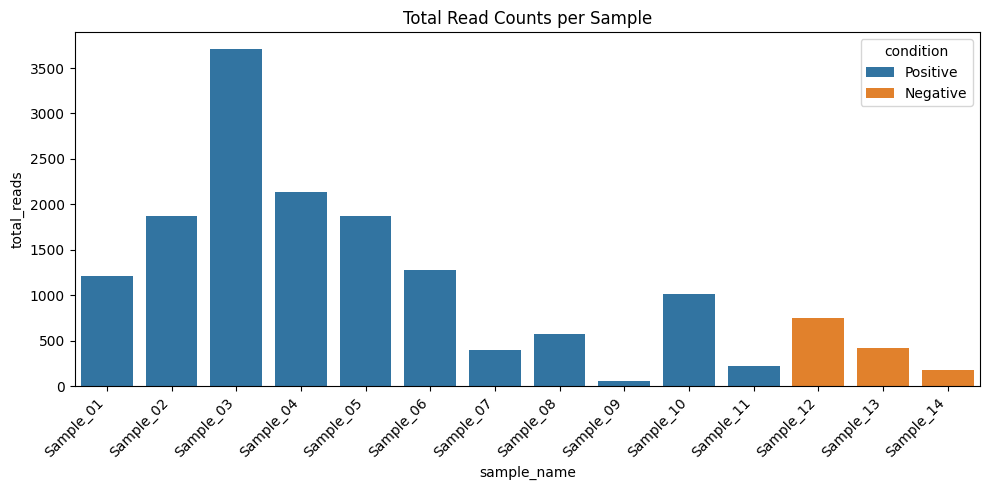

# (PART) COUNT EXPLORATION {-}

# How do you explore total read counts per sample before normalization?

## Explanation

Before performing any normalization or downstream analysis, it's important to check the total read counts (library sizes) across all samples. This helps identify:

- ⚠️ Potential outliers or failed libraries
- 📉 Low-coverage samples that might skew differential expression
- 📊 Overall distribution differences across conditions

By visualizing total counts per sample, we can assess whether further filtering or batch correction might be necessary.

## Python Code


```python
import pandas as pd
import seaborn as sns
import matplotlib.pyplot as plt

# 🔹 Load data
counts = pd.read_csv("data/demo_counts.csv", index_col=0)
metadata = pd.read_csv("data/demo_metadata.csv")

# 🔍 Compute total counts per sample
total_counts = counts.sum(axis=0).reset_index()
total_counts.columns = ["sample_name", "total_reads"]

# 🔗 Merge with metadata
plot_data = pd.merge(total_counts, metadata, on="sample_name")

# 📊 Barplot
plt.figure(figsize=(10, 5))
sns.barplot(data=plot_data, x="sample_name", y="total_reads", hue="condition")
plt.xticks(rotation=45, ha="right")
plt.title("Total Read Counts per Sample")
plt.tight_layout()
plt.show()

```


    

    


## R Code
```{r}
library(tidyverse)

# 🔹 Load data
counts <- read_csv("data/demo_counts.csv") %>%
  column_to_rownames("gene")
metadata <- read_csv("data/demo_metadata.csv")

# 🔍 Compute total counts per sample
total_reads <- colSums(counts) %>%
  enframe(name = "sample_name", value = "total_reads")

# 🔗 Merge with metadata
plot_data <- left_join(total_reads, metadata, by = "sample_name")

# 📊 Barplot
ggplot(plot_data, aes(x = sample_name, y = total_reads, fill = condition)) +
  geom_col() +
  labs(title = "Total Read Counts per Sample", y = "Total Reads", x = "Sample") +
  theme_minimal() +
  theme(axis.text.x = element_text(angle = 45, hjust = 1))
```

> ✅ **Takeaway:** Exploring total read counts helps detect inconsistencies early. Investigate samples with unusually low or high counts before trusting downstream results.

# How do you log-transform RNA-Seq counts for PCA or clustering?

## Explanation

Raw RNA-Seq counts are highly skewed and **heteroscedastic**—meaning the variance increases with expression. This makes them unsuitable for clustering, PCA, or heatmap generation because:

- Counts are **not normally distributed**
- **High-expression genes dominate** signal
- **Variance is not stabilized**, which distorts distance-based methods

To address this, we apply a **log2 transformation**, such as:

- `log2(count + 1)` – quick and interpretable
- `rlog()` or `vst()` – DESeq2 methods that stabilize variance more robustly

These transformations are essential to ensure that visualizations like **PCA plots**, **boxplots**, and **heatmaps** reflect meaningful biological structure rather than artifacts of scale or count depth.

> 📌 **Reminder:** Transformation is a core step in RNA-Seq EDA—it unlocks the ability to "see" patterns clearly.

## Python Code


```python
import pandas as pd
import numpy as np
import seaborn as sns
import matplotlib.pyplot as plt

# 🔹 Load and log-transform
counts = pd.read_csv("data/demo_counts.csv", index_col=0)
log_counts = np.log2(counts + 1)

# 🔍 Preview a few genes

log_counts.iloc[:5, :5]


```


<div>
<style scoped>
    .dataframe tbody tr th:only-of-type {
        vertical-align: middle;
    }

    .dataframe tbody tr th {
        vertical-align: top;
    }

    .dataframe thead th {
        text-align: right;
    }
</style>
<table border="1" class="dataframe">
  <thead>
    <tr style="text-align: right;">
      <th></th>
      <th>Sample_01</th>
      <th>Sample_02</th>
      <th>Sample_03</th>
      <th>Sample_04</th>
      <th>Sample_05</th>
    </tr>
    <tr>
      <th>gene</th>
      <th></th>
      <th></th>
      <th></th>
      <th></th>
      <th></th>
    </tr>
  </thead>
  <tbody>
    <tr>
      <th>SEC24B-AS1</th>
      <td>1.584963</td>
      <td>3.169925</td>
      <td>2.321928</td>
      <td>2.807355</td>
      <td>2.321928</td>
    </tr>
    <tr>
      <th>A1BG</th>
      <td>0.000000</td>
      <td>1.000000</td>
      <td>1.000000</td>
      <td>2.584963</td>
      <td>0.000000</td>
    </tr>
    <tr>
      <th>A1CF</th>
      <td>3.807355</td>
      <td>5.727920</td>
      <td>5.930737</td>
      <td>0.000000</td>
      <td>5.727920</td>
    </tr>
    <tr>
      <th>GGACT</th>
      <td>2.807355</td>
      <td>0.000000</td>
      <td>1.000000</td>
      <td>2.584963</td>
      <td>2.584963</td>
    </tr>
    <tr>
      <th>A2M</th>
      <td>10.211888</td>
      <td>10.824959</td>
      <td>11.830515</td>
      <td>11.050529</td>
      <td>10.820977</td>
    </tr>
  </tbody>
</table>
</div>


## R Code
```{r}
library(tidyverse)
library(DESeq2)

# 🔹 Load and log-transform
counts <- read_csv("data/demo_counts.csv") %>%
  column_to_rownames("gene")
metadata <- read_csv("data/demo_metadata.csv")

# 🧬 Prepare DESeq2 object
dds <- DESeqDataSetFromMatrix(countData = counts, colData = metadata, design = ~ condition)

# 🔄 Apply regularized log transformation
rlog_counts <- rlog(dds)

# 🔍 Preview
assay(rlog_counts)[1:5, 1:5]
```

> ✅ **Takeaway:** Always log-transform count data before applying distance-based methods like PCA or clustering. Use `rlog()` or `vst()` for more reliable results on small datasets.

# How do you perform PCA to explore sample similarity?

## Explanation

Principal Component Analysis (PCA) is a standard technique to explore global sample differences based on gene expression patterns. In RNA-Seq, PCA is often applied **after log-transformation** (e.g., `log2(count + 1)`, `rlog()`, or `vst()`).

It helps identify:

- 🔍 Clusters of biologically similar samples
- ⚠️ Potential outliers or mislabeled conditions
- 📊 The amount of variance explained by key components

## Python Code


```python
import pandas as pd
import numpy as np
import seaborn as sns
import matplotlib.pyplot as plt
from sklearn.decomposition import PCA

# 🔄 Set seed for reproducibility
np.random.seed(42)

# 🔹 Load data
counts = pd.read_csv("data/demo_counts.csv", index_col=0)
metadata = pd.read_csv("data/demo_metadata.csv")
log_counts = np.log2(counts + 1)

# 🎯 PCA
pca = PCA(n_components=2)
pca_result = pca.fit_transform(log_counts.T)
pca_df = pd.DataFrame(pca_result, columns=["PC1", "PC2"])
pca_df["sample_name"] = log_counts.columns
pca_df = pca_df.merge(metadata, on="sample_name")

# 📊 Plot
plt.figure(figsize=(6, 5))
sns.scatterplot(data=pca_df, x="PC1", y="PC2", hue="condition", s=100)
plt.title("PCA of Log-Transformed Counts")
plt.xlabel(f"PC1 ({pca.explained_variance_ratio_[0]:.1%} variance)")
plt.ylabel(f"PC2 ({pca.explained_variance_ratio_[1]:.1%} variance)")
plt.tight_layout()
plt.show()
```


    

    


## R Code
```{r}
library(tidyverse)
library(DESeq2)
library(ggplot2)

# 🔄 Set seed for reproducibility
set.seed(42)

# 🔹 Load and transform
counts <- read_csv("data/demo_counts.csv") %>%
  column_to_rownames("gene")
metadata <- read_csv("data/demo_metadata.csv")

dds <- DESeqDataSetFromMatrix(countData = counts, colData = metadata, design = ~ condition)
rlog_counts <- rlog(dds)

# 🎯 PCA plot
pca_data <- plotPCA(rlog_counts, intgroup = "condition", returnData = TRUE)
percentVar <- round(100 * attr(pca_data, "percentVar"))

# 📊 Plot
ggplot(pca_data, aes(PC1, PC2, color = condition)) +
  geom_point(size = 3) +
  labs(title = "PCA of RNA-Seq Samples",
       x = paste0("PC1 (", percentVar[1], "%)"),
       y = paste0("PC2 (", percentVar[2], "%)")) +
  theme_minimal()

# 👁️ Preview top 5x5 matrix
assay(rlog_counts)[1:5, 1:5]
```

> ✅ **Takeaway:** PCA helps you understand how samples cluster before any statistical testing. Always log-transform your data and set a seed for reproducibility.
