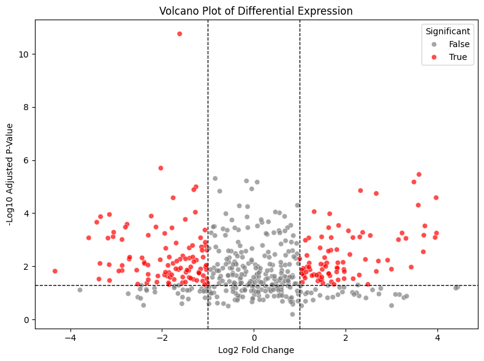
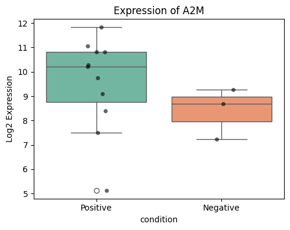

# (PART) GENE EXPRESSION  VISUALIZATION{-}


# How do you visualize differentially expressed genes with a volcano plot?

## Explanation

A **volcano plot** combines both statistical significance and effect size in one visual:

- **X-axis**: log2 fold change (magnitude of expression difference)
- **Y-axis**: -log10 adjusted p-value (significance)
- Helps highlight genes that are both **statistically significant** and **strongly regulated**
- Typically uses color to distinguish significant genes for quick interpretation

## Python Code


```python
import pandas as pd
import numpy as np
import seaborn as sns
import matplotlib.pyplot as plt

# 🔹 Load DE results (exported from R)
res_df = pd.read_csv("data/deseq2_results.csv")

# 🧪 Add significance status
res_df["significant"] = (res_df["padj"] < 0.05) & (abs(res_df["log2FoldChange"]) > 1)

# 📊 Volcano plot
plt.figure(figsize=(8, 6))
sns.scatterplot(data=res_df,
                x="log2FoldChange",
                y=-np.log10(res_df["padj"]),
                hue="significant",
                palette={True: "red", False: "gray"},
                alpha=0.7)
plt.axhline(-np.log10(0.05), linestyle="--", color="black", linewidth=1)
plt.axvline(x=-1, linestyle="--", color="black", linewidth=1)
plt.axvline(x=1, linestyle="--", color="black", linewidth=1)
plt.title("Volcano Plot of Differential Expression")
plt.xlabel("Log2 Fold Change")
plt.ylabel("-Log10 Adjusted P-Value")
plt.legend(title="Significant")
plt.tight_layout()
plt.show()


```


    

    


## R Code
```{r}
library(tidyverse)

# 🔹 Load saved DESeq2 results from CSV
res_df <- read_csv("data/deseq2_results.csv") %>%
  drop_na(log2FoldChange, padj) %>%
  mutate(significant = padj < 0.05 & abs(log2FoldChange) > 1)

# 📊 Volcano plot
ggplot(res_df, aes(x = log2FoldChange, y = -log10(padj), color = significant)) +
  geom_point(alpha = 0.6, size = 2) +
  scale_color_manual(values = c("FALSE" = "gray", "TRUE" = "red")) +
  geom_vline(xintercept = c(-1, 1), linetype = "dashed") +
  geom_hline(yintercept = -log10(0.05), linetype = "dashed") +
  labs(title = "Volcano Plot of Differential Expression",
       x = "Log2 Fold Change", y = "-Log10 Adjusted P-Value") +
  theme_minimal()
```

> **Takeaway**: ✅ Volcano plots help visualize genes with both strong effect size and statistical significance, making it easier to prioritize candidates for downstream analysis or validation. Use clear thresholds (e.g., log2FC > 1, padj < 0.05) to highlight key hits

# How do you visualize the expression of a single gene with a boxplot?

## Explanation

Once differential expression is complete, it's common to visualize individual genes of interest. A **boxplot** shows how expression levels vary across conditions.

To make this plot:
- Use **log-transformed counts** (e.g., from `rlog()` or `log2(count + 1)`)
- Select one gene of interest from the DE results
- Combine expression values with sample metadata

## Python Code


```python
import pandas as pd
import numpy as np
import seaborn as sns
import matplotlib.pyplot as plt

# 🔹 Load and prepare data
log_counts = np.log2(pd.read_csv("data/demo_counts.csv", index_col=0) + 1)
metadata = pd.read_csv("data/demo_metadata.csv")
gene_to_plot = "A2M"

# 🔍 Check if gene exists
if gene_to_plot not in log_counts.index:
    raise ValueError(f"{gene_to_plot} not found in count matrix.")

# 🧬 Prepare long-form dataframe
df_plot = pd.DataFrame({
    "expression": log_counts.loc[gene_to_plot],
    "sample_name": log_counts.columns
}).merge(metadata, on="sample_name")

# 📦 Boxplot
plt.figure(figsize=(5, 4))
sns.boxplot(data=df_plot, x="condition", y="expression", palette="Set2")
sns.stripplot(data=df_plot, x="condition", y="expression", color="black", alpha=0.6)
plt.title(f"Expression of {gene_to_plot}")
plt.ylabel("Log2 Expression")
plt.tight_layout()
plt.show()

```

    /var/folders/m1/0dxpqygn2ds41kxkjgwtftr00000gn/T/ipykernel_52778/1503619118.py:23: FutureWarning: 
    
    Passing `palette` without assigning `hue` is deprecated and will be removed in v0.14.0. Assign the `x` variable to `hue` and set `legend=False` for the same effect.
    
      sns.boxplot(data=df_plot, x="condition", y="expression", palette="Set2")


    

    


## R Code
```{r}
library(tidyverse)
library(DESeq2)

# 🔄 Set seed for reproducibility
set.seed(42)

# 🔹 Load and transform
counts <- read_csv("data/demo_counts.csv") %>%
  column_to_rownames("gene")
metadata <- read_csv("data/demo_metadata.csv")

dds <- DESeqDataSetFromMatrix(countData = counts,
                              colData = metadata,
                              design = ~ condition)
rlog_counts <- rlog(dds)

# 🔍 Gene to plot
gene_to_plot <- "A2M"
if (!gene_to_plot %in% rownames(rlog_counts)) stop("Gene not found.")

# 📦 Prepare dataframe
plot_data <- data.frame(
  expression = assay(rlog_counts)[gene_to_plot, ],
  sample_name = colnames(rlog_counts)
) %>%
  left_join(metadata, by = "sample_name")

# 📊 Boxplot
ggplot(plot_data, aes(x = condition, y = expression)) +
  geom_boxplot(fill = "skyblue", alpha = 0.6) +
  geom_jitter(width = 0.1) +
  labs(title = paste("Expression of", gene_to_plot),
       y = "Log2 Expression") +
  theme_minimal()
```

> ✅ **Takeaway:** Use boxplots to clearly visualize how expression of a specific gene differs between conditions. Combine with DE results to validate biological interpretation.

# How do you summarize expression changes with an MA plot?

## Explanation

An **MA plot** (short for **Minus vs. Average plot**) displays the relationship between:

- **M (log ratio)** = log2 fold change (Y-axis), showing the difference in expression between conditions  
- **A (mean average)** = average expression across all samples (X-axis), typically on a log scale

This visualization helps identify:

- ✳️ Genes with **large fold changes**
- ⚠️ Low-abundance genes with unstable variance
- 🔍 Systematic biases or asymmetries in the DE results

It’s especially useful after running DESeq2, as the result object already contains both `baseMean` (A) and `log2FoldChange` (M).


## Python Code

> ℹ️ Make sure `data/deseq2_results.csv` is available, saved from the R step.


```python
import pandas as pd
import numpy as np
import seaborn as sns
import matplotlib.pyplot as plt

# 🔹 Load DE results
res_df = pd.read_csv("data/deseq2_results.csv")

# 🧪 Add significance flag
res_df["significant"] = (res_df["padj"] < 0.05) & (abs(res_df["log2FoldChange"]) > 1)

# 📊 MA plot
plt.figure(figsize=(8, 6))
sns.scatterplot(data=res_df,
                x=np.log10(res_df["baseMean"] + 1),
                y=res_df["log2FoldChange"],
                hue="significant",
                palette={True: "red", False: "gray"},
                alpha=0.6)
plt.axhline(0, linestyle="--", color="black")
plt.title("MA Plot of Differential Expression")
plt.xlabel("Log10 Mean Expression (baseMean)")
plt.ylabel("Log2 Fold Change")
plt.legend(title="Significant")
plt.tight_layout()
plt.show()

```


    

    


## R Code
```{r}
library(tidyverse)

# 🔹 Load saved DESeq2 results
res_df <- read_csv("data/deseq2_results.csv") %>%
  drop_na(baseMean, log2FoldChange, padj) %>%
  mutate(
    significant = padj < 0.05 & abs(log2FoldChange) > 1,
    log_baseMean = log10(baseMean + 1)  # Avoid log10(0)
  )

# 📉 MA Plot
ggplot(res_df, aes(x = log_baseMean, y = log2FoldChange, color = significant)) +
  geom_point(alpha = 0.6, size = 2) +
  scale_color_manual(values = c("FALSE" = "gray", "TRUE" = "blue")) +
  geom_hline(yintercept = c(-1, 1), linetype = "dashed") +
  labs(
    title = "MA Plot of Differential Expression",
    x = "Log10 Mean Expression (baseMean)",
    y = "Log2 Fold Change"
  ) +
  theme_minimal()
```

> ✅ **Takeaway:** MA plots reveal expression trends across the full dynamic range of genes. Use them to verify if your DE analysis is symmetric and highlight low-abundance noise.
