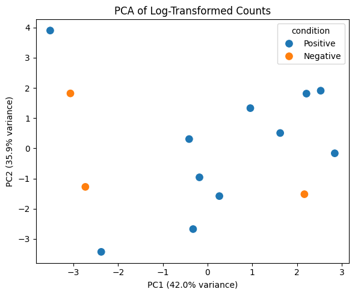

# (PART) COUNT EXPLORATION {-}

# How do you explore total read counts per sample before normalization?

## Explanation

Before performing any normalization or downstream analysis, it's important to check the total read counts (library sizes) across all samples. This helps identify:

- ⚠️ Potential outliers or failed libraries
- 📉 Low-coverage samples that might skew differential expression
- 📊 Overall distribution differences across conditions

By visualizing total counts per sample, we can assess whether further filtering or batch correction might be necessary.

## Python Code


```python
import pandas as pd
import seaborn as sns
import matplotlib.pyplot as plt

# 🔹 Load data
counts = pd.read_csv("data/demo_counts.csv", index_col=0)
metadata = pd.read_csv("data/demo_metadata.csv")

# 🔍 Compute total counts per sample
total_counts = counts.sum(axis=0).reset_index()
total_counts.columns = ["sample_name", "total_reads"]

# 🔗 Merge with metadata
plot_data = pd.merge(total_counts, metadata, on="sample_name")

# 📊 Barplot
plt.figure(figsize=(10, 5))
sns.barplot(data=plot_data, x="sample_name", y="total_reads", hue="condition")
plt.xticks(rotation=45, ha="right")
plt.title("Total Read Counts per Sample")
plt.tight_layout()
plt.show()

```


    

    


## R Code
```{r}
library(tidyverse)

# 🔹 Load data
counts <- read_csv("data/demo_counts.csv") %>%
  column_to_rownames("gene")
metadata <- read_csv("data/demo_metadata.csv")

# 🔍 Compute total counts per sample
total_reads <- colSums(counts) %>%
  enframe(name = "sample_name", value = "total_reads")

# 🔗 Merge with metadata
plot_data <- left_join(total_reads, metadata, by = "sample_name")

# 📊 Barplot
ggplot(plot_data, aes(x = sample_name, y = total_reads, fill = condition)) +
  geom_col() +
  labs(title = "Total Read Counts per Sample", y = "Total Reads", x = "Sample") +
  theme_minimal() +
  theme(axis.text.x = element_text(angle = 45, hjust = 1))
```

> ✅ **Takeaway:** Exploring total read counts helps detect inconsistencies early. Investigate samples with unusually low or high counts before trusting downstream results.

# How do you log-transform RNA-Seq counts for PCA or clustering?

## Explanation

Raw RNA-Seq counts are highly skewed and **heteroscedastic**—meaning the variance increases with expression. This makes them unsuitable for clustering, PCA, or heatmap generation because:

- Counts are **not normally distributed**
- **High-expression genes dominate** signal
- **Variance is not stabilized**, which distorts distance-based methods

To address this, we apply a **log2 transformation**, such as:

- `log2(count + 1)` – quick and interpretable
- `rlog()` or `vst()` – DESeq2 methods that stabilize variance more robustly

These transformations are essential to ensure that visualizations like **PCA plots**, **boxplots**, and **heatmaps** reflect meaningful biological structure rather than artifacts of scale or count depth.

> 📌 **Reminder:** Transformation is a core step in RNA-Seq EDA—it unlocks the ability to "see" patterns clearly.

## Python Code


```python
import pandas as pd
import numpy as np
import seaborn as sns
import matplotlib.pyplot as plt

# 🔹 Load and log-transform
counts = pd.read_csv("data/demo_counts.csv", index_col=0)
log_counts = np.log2(counts + 1)

# 🔍 Preview a few genes

log_counts.iloc[:5, :5]


```


<div>
<style scoped>
    .dataframe tbody tr th:only-of-type {
        vertical-align: middle;
    }

    .dataframe tbody tr th {
        vertical-align: top;
    }

    .dataframe thead th {
        text-align: right;
    }
</style>
<table border="1" class="dataframe">
  <thead>
    <tr style="text-align: right;">
      <th></th>
      <th>Sample_01</th>
      <th>Sample_02</th>
      <th>Sample_03</th>
      <th>Sample_04</th>
      <th>Sample_05</th>
    </tr>
    <tr>
      <th>gene</th>
      <th></th>
      <th></th>
      <th></th>
      <th></th>
      <th></th>
    </tr>
  </thead>
  <tbody>
    <tr>
      <th>SEC24B-AS1</th>
      <td>1.584963</td>
      <td>3.169925</td>
      <td>2.321928</td>
      <td>2.807355</td>
      <td>2.321928</td>
    </tr>
    <tr>
      <th>A1BG</th>
      <td>0.000000</td>
      <td>1.000000</td>
      <td>1.000000</td>
      <td>2.584963</td>
      <td>0.000000</td>
    </tr>
    <tr>
      <th>A1CF</th>
      <td>3.807355</td>
      <td>5.727920</td>
      <td>5.930737</td>
      <td>0.000000</td>
      <td>5.727920</td>
    </tr>
    <tr>
      <th>GGACT</th>
      <td>2.807355</td>
      <td>0.000000</td>
      <td>1.000000</td>
      <td>2.584963</td>
      <td>2.584963</td>
    </tr>
    <tr>
      <th>A2M</th>
      <td>10.211888</td>
      <td>10.824959</td>
      <td>11.830515</td>
      <td>11.050529</td>
      <td>10.820977</td>
    </tr>
  </tbody>
</table>
</div>


## R Code
```{r}
library(tidyverse)
library(DESeq2)

# 🔹 Load and log-transform
counts <- read_csv("data/demo_counts.csv") %>%
  column_to_rownames("gene")
metadata <- read_csv("data/demo_metadata.csv")

# 🧬 Prepare DESeq2 object
dds <- DESeqDataSetFromMatrix(countData = counts, colData = metadata, design = ~ condition)

# 🔄 Apply regularized log transformation
rlog_counts <- rlog(dds)

# 🔍 Preview
assay(rlog_counts)[1:5, 1:5]
```

> ✅ **Takeaway:** Always log-transform count data before applying distance-based methods like PCA or clustering. Use `rlog()` or `vst()` for more reliable results on small datasets.

# How do you perform PCA to explore sample similarity?

## Explanation

Principal Component Analysis (PCA) is a standard technique to explore global sample differences based on gene expression patterns. In RNA-Seq, PCA is often applied **after log-transformation** (e.g., `log2(count + 1)`, `rlog()`, or `vst()`).

It helps identify:

- 🔍 Clusters of biologically similar samples
- ⚠️ Potential outliers or mislabeled conditions
- 📊 The amount of variance explained by key components

## Python Code


```python
import pandas as pd
import numpy as np
import seaborn as sns
import matplotlib.pyplot as plt
from sklearn.decomposition import PCA

# 🔄 Set seed for reproducibility
np.random.seed(42)

# 🔹 Load data
counts = pd.read_csv("data/demo_counts.csv", index_col=0)
metadata = pd.read_csv("data/demo_metadata.csv")
log_counts = np.log2(counts + 1)

# 🎯 PCA
pca = PCA(n_components=2)
pca_result = pca.fit_transform(log_counts.T)
pca_df = pd.DataFrame(pca_result, columns=["PC1", "PC2"])
pca_df["sample_name"] = log_counts.columns
pca_df = pca_df.merge(metadata, on="sample_name")

# 📊 Plot
plt.figure(figsize=(6, 5))
sns.scatterplot(data=pca_df, x="PC1", y="PC2", hue="condition", s=100)
plt.title("PCA of Log-Transformed Counts")
plt.xlabel(f"PC1 ({pca.explained_variance_ratio_[0]:.1%} variance)")
plt.ylabel(f"PC2 ({pca.explained_variance_ratio_[1]:.1%} variance)")
plt.tight_layout()
plt.show()
```


    

    


## R Code
```{r}
library(tidyverse)
library(DESeq2)
library(ggplot2)

# 🔄 Set seed for reproducibility
set.seed(42)

# 🔹 Load and transform
counts <- read_csv("data/demo_counts.csv") %>%
  column_to_rownames("gene")
metadata <- read_csv("data/demo_metadata.csv")

dds <- DESeqDataSetFromMatrix(countData = counts, colData = metadata, design = ~ condition)
rlog_counts <- rlog(dds)

# 🎯 PCA plot
pca_data <- plotPCA(rlog_counts, intgroup = "condition", returnData = TRUE)
percentVar <- round(100 * attr(pca_data, "percentVar"))

# 📊 Plot
ggplot(pca_data, aes(PC1, PC2, color = condition)) +
  geom_point(size = 3) +
  labs(title = "PCA of RNA-Seq Samples",
       x = paste0("PC1 (", percentVar[1], "%)"),
       y = paste0("PC2 (", percentVar[2], "%)")) +
  theme_minimal()

# 👁️ Preview top 5x5 matrix
assay(rlog_counts)[1:5, 1:5]
```

> ✅ **Takeaway:** PCA helps you understand how samples cluster before any statistical testing. Always log-transform your data and set a seed for reproducibility.

# (PART) DIFFERENTIAL GENE EXPRESSION {-}

# How do you perform differential gene expression analysis using DESeq2?

## Explanation

Once the count matrix and sample metadata are properly loaded and matched, we use **DESeq2** to identify genes that are significantly differentially expressed between experimental conditions.

DESeq2 performs a robust multi-step process:

1. 📊 **Estimates size factors** to normalize for library depth  
2. 🔁 **Calculates dispersion** for each gene to model biological variability  
3. ⚙️ **Fits a negative binomial generalized linear model (GLM)** to the counts  
4. 🧪 **Tests for significance** using the Wald test (or LRT if specified)  
5. 📉 **Adjusts p-values** using False Discovery Rate (FDR) correction  

The result is a table of genes with corresponding **log2 fold changes**, **p-values**, and **adjusted p-values**—ready for interpretation and visualization.

## Python Code


```python
# NOTE: DESeq2 is R-based; in Python, use rpy2 or export counts and run DE in R
# Placeholder: Python can handle visualization of DE results after exporting from R

```

## R Code
The code below is store in `scripts/res-df.R`

```{R}
library(tidyverse)
library(DESeq2)

# 🔄 Set seed for reproducibility
set.seed(42)

# 🔹 Load data
counts <- read_csv("data/demo_counts.csv") %>%
  column_to_rownames("gene")
metadata <- read_csv("data/demo_metadata.csv")

# 🧬 Create DESeq2 object
dds <- DESeqDataSetFromMatrix(countData = counts,
                              colData = metadata,
                              design = ~ condition)

# ⚙️ Run DE analysis
dds <- DESeq(dds)

# 📋 Extract results
res <- results(dds)

# 🧼 Clean results
res_df <- as.data.frame(res) %>%
  rownames_to_column("gene") %>%
  arrange(padj)

# 💾 Save for downstream visualization if not already saved
if (!file.exists("data/deseq2_results.csv")) {
  write_csv(res_df, "data/deseq2_results.csv")
}

# 👁️ Preview top results
head(res_df, 5)
```

> ✅ **Takeaway:** DESeq2 provides robust statistical testing for identifying differentially expressed genes. Always inspect and sort results by adjusted p-value (`padj`) to focus on the most significant findings.

# How do you visualize differentially expressed genes with a volcano plot?

## Explanation

A **volcano plot** combines both statistical significance and effect size in one visual:

- **X-axis**: log2 fold change (magnitude of expression difference)
- **Y-axis**: -log10 adjusted p-value (significance)
- Helps highlight genes that are both **statistically significant** and **strongly regulated**
- Typically uses color to distinguish significant genes for quick interpretation

## Python Code

> ℹ️ Make sure the file `data/deseq2_results.csv` has already been saved by the (above) R code from the DESeq2 step.


```python
import pandas as pd
import numpy as np
import seaborn as sns
import matplotlib.pyplot as plt

# 🔹 Load DE results (exported from R)
res_df = pd.read_csv("data/deseq2_results.csv")

# 🧪 Add significance status
res_df["significant"] = (res_df["padj"] < 0.05) & (abs(res_df["log2FoldChange"]) > 1)

# 📊 Volcano plot
plt.figure(figsize=(8, 6))
sns.scatterplot(data=res_df,
                x="log2FoldChange",
                y=-np.log10(res_df["padj"]),
                hue="significant",
                palette={True: "red", False: "gray"},
                alpha=0.7)
plt.axhline(-np.log10(0.05), linestyle="--", color="black", linewidth=1)
plt.axvline(x=-1, linestyle="--", color="black", linewidth=1)
plt.axvline(x=1, linestyle="--", color="black", linewidth=1)
plt.title("Volcano Plot of Differential Expression")
plt.xlabel("Log2 Fold Change")
plt.ylabel("-Log10 Adjusted P-Value")
plt.legend(title="Significant")
plt.tight_layout()
plt.show()


```


    

    


## R Code
```{r}
library(tidyverse)

# 🔹 Load saved DESeq2 results from CSV
res_df <- read_csv("data/deseq2_results.csv") %>%
  drop_na(log2FoldChange, padj) %>%
  mutate(significant = padj < 0.05 & abs(log2FoldChange) > 1)

# 📊 Volcano plot
ggplot(res_df, aes(x = log2FoldChange, y = -log10(padj), color = significant)) +
  geom_point(alpha = 0.6, size = 2) +
  scale_color_manual(values = c("FALSE" = "gray", "TRUE" = "red")) +
  geom_vline(xintercept = c(-1, 1), linetype = "dashed") +
  geom_hline(yintercept = -log10(0.05), linetype = "dashed") +
  labs(title = "Volcano Plot of Differential Expression",
       x = "Log2 Fold Change", y = "-Log10 Adjusted P-Value") +
  theme_minimal()
```

> **Takeaway**: ✅ Volcano plots help visualize genes with both strong effect size and statistical significance, making it easier to prioritize candidates for downstream analysis or validation. Use clear thresholds (e.g., log2FC > 1, padj < 0.05) to highlight key hits

# How do you visualize the expression of a single gene with a boxplot?

## Explanation

Once differential expression is complete, it's common to visualize individual genes of interest. A **boxplot** shows how expression levels vary across conditions.

To make this plot:
- Use **log-transformed counts** (e.g., from `rlog()` or `log2(count + 1)`)
- Select one gene of interest from the DE results
- Combine expression values with sample metadata

## Python Code


```python
import pandas as pd
import numpy as np
import seaborn as sns
import matplotlib.pyplot as plt

# 🔹 Load and prepare data
log_counts = np.log2(pd.read_csv("data/demo_counts.csv", index_col=0) + 1)
metadata = pd.read_csv("data/demo_metadata.csv")
gene_to_plot = "A2M"

# 🔍 Check if gene exists
if gene_to_plot not in log_counts.index:
    raise ValueError(f"{gene_to_plot} not found in count matrix.")

# 🧬 Prepare long-form dataframe
df_plot = pd.DataFrame({
    "expression": log_counts.loc[gene_to_plot],
    "sample_name": log_counts.columns
}).merge(metadata, on="sample_name")

# 📦 Boxplot
plt.figure(figsize=(5, 4))
sns.boxplot(data=df_plot, x="condition", y="expression", palette="Set2")
sns.stripplot(data=df_plot, x="condition", y="expression", color="black", alpha=0.6)
plt.title(f"Expression of {gene_to_plot}")
plt.ylabel("Log2 Expression")
plt.tight_layout()
plt.show()

```

    /var/folders/m1/0dxpqygn2ds41kxkjgwtftr00000gn/T/ipykernel_41833/1503619118.py:23: FutureWarning: 
    
    Passing `palette` without assigning `hue` is deprecated and will be removed in v0.14.0. Assign the `x` variable to `hue` and set `legend=False` for the same effect.
    
      sns.boxplot(data=df_plot, x="condition", y="expression", palette="Set2")


    

    


## R Code
```{r}
library(tidyverse)
library(DESeq2)

# 🔄 Set seed for reproducibility
set.seed(42)

# 🔹 Load and transform
counts <- read_csv("data/demo_counts.csv") %>%
  column_to_rownames("gene")
metadata <- read_csv("data/demo_metadata.csv")

dds <- DESeqDataSetFromMatrix(countData = counts,
                              colData = metadata,
                              design = ~ condition)
rlog_counts <- rlog(dds)

# 🔍 Gene to plot
gene_to_plot <- "A2M"
if (!gene_to_plot %in% rownames(rlog_counts)) stop("Gene not found.")

# 📦 Prepare dataframe
plot_data <- data.frame(
  expression = assay(rlog_counts)[gene_to_plot, ],
  sample_name = colnames(rlog_counts)
) %>%
  left_join(metadata, by = "sample_name")

# 📊 Boxplot
ggplot(plot_data, aes(x = condition, y = expression)) +
  geom_boxplot(fill = "skyblue", alpha = 0.6) +
  geom_jitter(width = 0.1) +
  labs(title = paste("Expression of", gene_to_plot),
       y = "Log2 Expression") +
  theme_minimal()
```

> ✅ **Takeaway:** Use boxplots to clearly visualize how expression of a specific gene differs between conditions. Combine with DE results to validate biological interpretation.

# How do you summarize expression changes with an MA plot?

## Explanation

An **MA plot** (short for **Minus vs. Average plot**) displays the relationship between:

- **M (log ratio)** = log2 fold change (Y-axis), showing the difference in expression between conditions  
- **A (mean average)** = average expression across all samples (X-axis), typically on a log scale

This visualization helps identify:

- ✳️ Genes with **large fold changes**
- ⚠️ Low-abundance genes with unstable variance
- 🔍 Systematic biases or asymmetries in the DE results

It’s especially useful after running DESeq2, as the result object already contains both `baseMean` (A) and `log2FoldChange` (M).


## Python Code

> ℹ️ Make sure `data/deseq2_results.csv` is available, saved from the R step.


```python
import pandas as pd
import numpy as np
import seaborn as sns
import matplotlib.pyplot as plt

# 🔹 Load DE results
res_df = pd.read_csv("data/deseq2_results.csv")

# 🧪 Add significance flag
res_df["significant"] = (res_df["padj"] < 0.05) & (abs(res_df["log2FoldChange"]) > 1)

# 📊 MA plot
plt.figure(figsize=(8, 6))
sns.scatterplot(data=res_df,
                x=np.log10(res_df["baseMean"] + 1),
                y=res_df["log2FoldChange"],
                hue="significant",
                palette={True: "red", False: "gray"},
                alpha=0.6)
plt.axhline(0, linestyle="--", color="black")
plt.title("MA Plot of Differential Expression")
plt.xlabel("Log10 Mean Expression (baseMean)")
plt.ylabel("Log2 Fold Change")
plt.legend(title="Significant")
plt.tight_layout()
plt.show()

```


    

    


## R Code
```{r}
library(tidyverse)

# 🔹 Load DE results saved during initial processing
res_df <- read_csv("data/deseq2_results.csv") %>%
  drop_na(log2FoldChange, padj) %>%
  mutate(significant = padj < 0.05 & abs(log2FoldChange) > 1)

# 📊 Volcano plot
ggplot(res_df, aes(x = log2FoldChange, y = -log10(padj), color = significant)) +
  geom_point(alpha = 0.6, size = 2) +
  scale_color_manual(values = c("FALSE" = "gray", "TRUE" = "red")) +
  geom_vline(xintercept = c(-1, 1), linetype = "dashed") +
  geom_hline(yintercept = -log10(0.05), linetype = "dashed") +
  labs(title = "Volcano Plot of Differential Expression",
       x = "Log2 Fold Change", y = "-Log10 Adjusted P-Value") +
  theme_minimal()
```

> ✅ **Takeaway:** MA plots reveal expression trends across the full dynamic range of genes. Use them to verify if your DE analysis is symmetric and highlight low-abundance noise.
